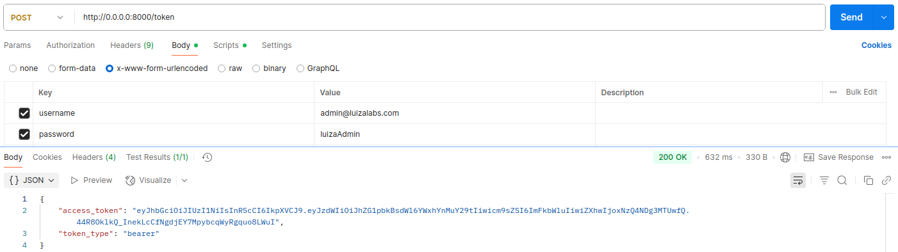
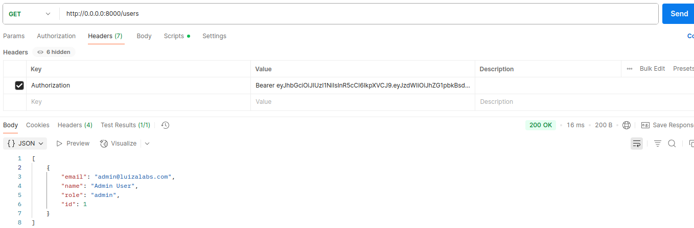

Repositório dedicado para cumprir desafio técnico, consistindo em uma API REST para cadastro
de usuários e inserção de produtos em Wishlist, com autenticação e autorização.

## Principais tecnologias utilizadas
- Python 3.10
- FastAPI
- MySQL

## Executar localmente
A API pode ser executada via Docker, basta executar alguns comandos definidos para subir ou desligar a API e o banco de dados MYSQL:
- `make up` -> Inicia os serviços (API e banco de dados)
- `make down` -> Desliga os serviços mantendo os dados do banco persistidos
- `make clean` -> Desliga os serviços e limpa o banco

## Autenticação e Autorização
Existem dois tipos de usuário: admin e customer. O usuário admin não adiciona produtos na wishlist
e tem liberdade de requisitar em todos os demais endpoints protegidos. O usuário customer
só tem permissão de requisitar quando o objeto de usuário da requisição é ele mesmo.
Exemplo: Um customer não pode adicionar um produto na wishlist de outro customer, mas um admin pode.

Para utilizar os endpoints da API é necessário se autenticar. É preciso gerar um token a partir do username (email) e senha
para o endpoint /token. Já há um usuário Admin pré definido para uso inicial antes de criar
um customer, e o token dele pode ser recuperado como no exemplo abaixo:

Após gerar o token, é possível fazer requisições para os demais endpoints
inserindo esse token nos headers da requisição, como no exemplo abaixo:

## Documentação da API
Clique para acessar a documentação dos endpoints da API
[Swagger UI](https://app.swaggerhub.com/apis-docs/juscelino/code-challenge/1.0.0-oas3.1)

## Indisponibilidade da API de Produtos
Tendo em vista a indisponibilidade da API de Produtos, ao adicionar o query parameter 
`test_products=true`, para demonstrar o funcionamento da API, vai funcionar com base
em um JSON que tem alguns produtos definidos, como um mock.
Caso essa flag não seja verdadeira, a requisição para a API de produtos é feita normalmente
e a príncipio será retornado um erro.

## Testes
Foi desenvolvida uma bateria de testes integrado e unitários automatizados usando o Pytest.
Para executar os testes, é preciso ter o Python instalado e estar dentro de uma venv e executar o comando `m̀ake test`.